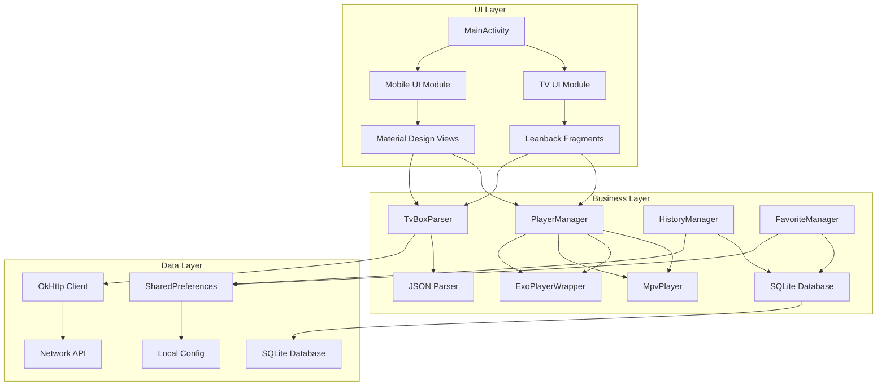

# Mobile TVBox Player

Feature Name: mobile-tvbox-player  
Updated: 2026-04-22

## Description

本项目是一个 Android 平台的双端（TV+ 手机）影视播放软件，支持导入 TVBox 点播源，集成 libmpv-android 主播放器和 ExoPlayer 备用播放器。提供简洁美观的 UI 界面，支持视频点播、历史记录和收藏功能。

## Architecture



### 架构说明

1. **UI Layer（UI 层）**: 负责界面展示和用户交互
   - TV 端使用 Leanback 框架
   - 手机端使用 Material Design 3
   
2. **Business Layer（业务层）**: 核心业务逻辑
   - PlayerManager: 播放器管理器
   - TvBoxParser: TVBox 源解析器
   - HistoryManager: 历史记录管理
   - FavoriteManager: 收藏管理
   
3. **Data Layer（数据层）**: 数据持久化和网络请求
   - OkHttp: 网络请求
   - SharedPreferences: 本地配置
   - SQLite: 结构化数据存储

## Components and Interfaces

### 1. PlayerManager

**职责**: 统一播放器接口，管理 libmpv 和 ExoPlayer 的切换

```java
public interface IVideoPlayer {
    void setSurface(Surface surface);
    void play(String url);
    void pause();
    void resume();
    void stop();
    void seekTo(long position);
    long getCurrentPosition();
    long getDuration();
    boolean isPlaying();
    void release();
}

public class PlayerManager {
    private IVideoPlayer currentPlayer;
    
    public void initPlayer(PlayerType type);
    public IVideoPlayer getPlayer();
    public PlayerType getCurrentPlayerType();
}
```

### 2. MpvPlayer

**职责**: 封装 libmpv-android 的 JNI 调用

```java
public class MpvPlayer implements IVideoPlayer {
    // Native methods
    private native long mpvCreate();
    private native int mpvInitialize(long handle);
    private native void mpvSetOptionString(long handle, String name, String value);
    private native int mpvCommand(long handle, String command);
    private native void mpvDestroy(long handle);
    
    // IVideoPlayer implementation
    @Override
    public void setSurface(Surface surface);
    @Override
    public void play(String url);
    // ... other methods
}
```

### 3. TvBoxParser

**职责**: 解析 TVBox 源 JSON 配置

```java
public class TvBoxParser {
    public interface ParseCallback {
        void onSuccess(TvBoxSource source);
        void onError(String error);
    }
    
    public static void parseFromUrl(String url, ParseCallback callback);
    public static void parseFromFile(File file, ParseCallback callback);
    public static TvBoxSource parseJson(String json);
}
```

### 4. HistoryManager

**职责**: 管理观看历史记录

```java
public class HistoryManager {
    public void addHistory(String title, String url, String siteName, 
                          long position, long duration);
    public List<HistoryItem> getHistory(int limit);
    public void removeHistory(long id);
    public void clearHistory();
    public HistoryItem getHistoryByUrl(String url);
}
```

### 5. FavoriteManager

**职责**: 管理收藏夹

```java
public class FavoriteManager {
    public boolean addFavorite(String title, String url, String siteName, 
                              String thumbnail);
    public boolean removeFavorite(String title);
    public boolean isFavorite(String title);
    public List<FavoriteItem> getAllFavorites();
}
```

## Data Models

### TvBoxSource

```java
public class TvBoxSource {
    private String name;           // 源名称
    private String url;            // 源 URL
    private List<VideoSite> sites; // 站点列表
    private long importTime;       // 导入时间
}
```

### VideoSite

```java
public class VideoSite {
    private String key;          // 站点唯一标识
    private String name;         // 站点名称
    private int type;            // 类型：0=web, 1=cms
    private String api;          // API 地址
    private int searchable;      // 是否可搜索：0=否，1=是
    private int changeable;      // 是否可切换：0=否，1=是
}
```

### HistoryItem

```java
public class HistoryItem {
    private long id;             // 记录 ID
    private String title;        // 视频标题
    private String url;          // 视频 URL
    private String siteName;     // 站点名称
    private long position;       // 观看进度（毫秒）
    private long duration;       // 视频总时长（毫秒）
    private long watchTime;      // 观看时间戳
}
```

### FavoriteItem

```java
public class FavoriteItem {
    private long id;             // 收藏 ID
    private String title;        // 视频标题
    private String url;          // 视频 URL
    private String siteName;     // 站点名称
    private String thumbnail;    // 缩略图 URL
    private long addTime;        // 添加时间戳
}
```

## Database Schema

### 历史记录表 (history)

```sql
CREATE TABLE IF NOT EXISTS history (
    id INTEGER PRIMARY KEY AUTOINCREMENT,
    title TEXT NOT NULL,
    video_url TEXT NOT NULL,
    site_name TEXT,
    position INTEGER DEFAULT 0,
    duration INTEGER DEFAULT 0,
    watch_time INTEGER NOT NULL
);

CREATE INDEX idx_watch_time ON history(watch_time DESC);
CREATE UNIQUE INDEX idx_url ON history(video_url);
```

### 收藏表 (favorites)

```sql
CREATE TABLE IF NOT EXISTS favorites (
    id INTEGER PRIMARY KEY AUTOINCREMENT,
    title TEXT UNIQUE NOT NULL,
    video_url TEXT NOT NULL,
    site_name TEXT,
    thumbnail TEXT,
    add_time INTEGER NOT NULL
);

CREATE INDEX idx_add_time ON favorites(add_time DESC);
```

## Correctness Properties

### 播放器状态不变性

1. 播放器在 release() 后不能再次使用
2. play() 必须在 setSurface() 之后调用
3. 同一时间只能有一个播放器实例处于 active 状态

### 数据一致性

1. 历史记录和视频标题必须匹配
2. 收藏夹中不能有重复标题
3. 观看进度不能超过视频总时长

## Error Handling

### 网络错误

```java
try {
    Response response = client.newCall(request).execute();
    if (!response.isSuccessful()) {
        throw new IOException("HTTP error: " + response.code());
    }
} catch (IOException e) {
    callback.onError("网络连接失败，请检查网络设置");
}
```

### 播放器错误

```java
try {
    currentPlayer.play(url);
} catch (MediaPlayerException e) {
    // 降级到备用播放器
    playerManager.initPlayer(PlayerType.EXO);
    currentPlayer.play(url);
}
```

### JSON 解析错误

```java
try {
    JSONObject obj = new JSONObject(json);
    // parse...
} catch (JSONException e) {
    callback.onError("配置文件格式错误");
}
```

## Test Strategy

### 单元测试

1. **TvBoxParserTest**: 测试 JSON 解析的正确性
2. **HistoryManagerTest**: 测试添加、查询、删除历史记录
3. **FavoriteManagerTest**: 测试收藏、取消收藏功能
4. **PlayerManagerTest**: 测试播放器初始化和切换

### 集成测试

1. **网络导入测试**: 测试从真实 URL 导入 TVBox 源
2. **播放测试**: 测试真实视频 URL 的播放
3. **UI 测试**: 使用 Espresso 测试 UI 交互

### 性能测试

1. **启动时间测试**: 冷启动时间 < 3 秒
2. **内存测试**: 运行时内存占用 < 200MB
3. **加载时间测试**: 视频加载时间 < 5 秒

## References

[^1]: (libmpv-android) - [GitHub Repository](https://github.com/mpv-android/mpv-android)
[^2]: (ExoPlayer) - [Official Guide](https://exoplayer.dev/)
[^3]: (Leanback) - [Android TV Development](https://developer.android.com/training/tv/start/start)
[^4]: (Material Design 3) - [Material Design Guidelines](https://m3.material.io/)
[^5]: (TVBox source format) - [TVBox JSON Schema](https://github.com/CatVodTVOfficial/TVBoxOSS)
